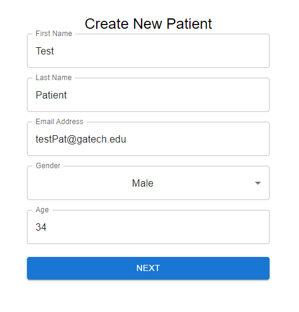
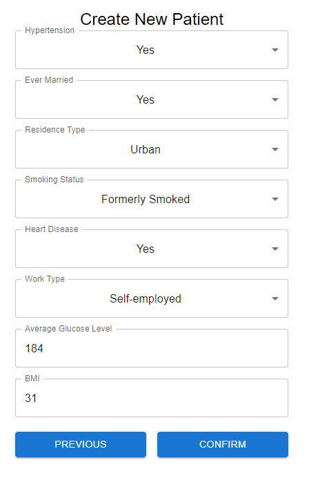
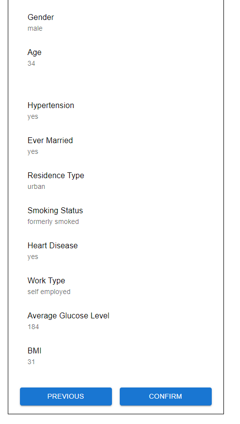
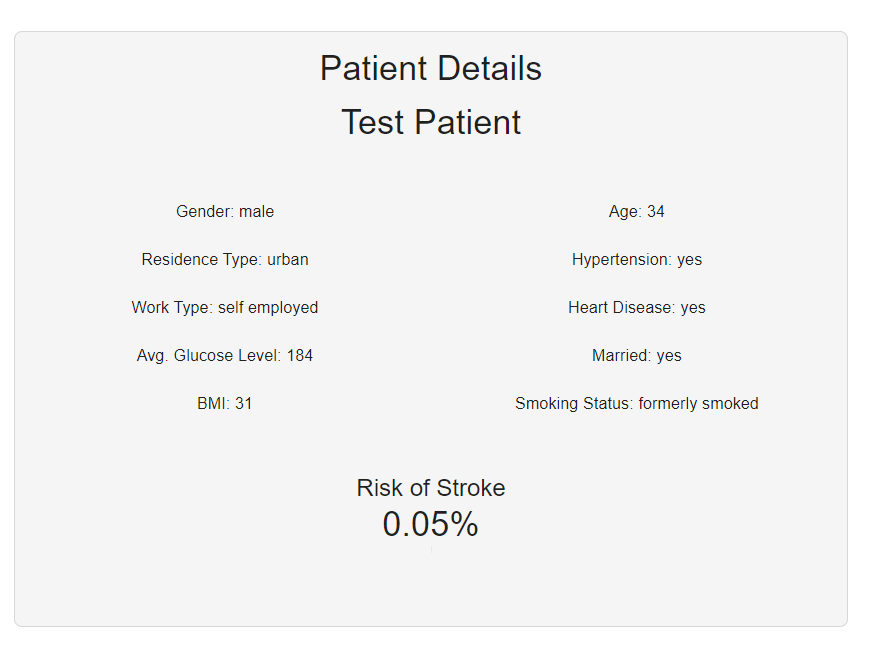

# BrainStroke-Risk-Prediction-WebApplication

Deployed app: https://stroke-prediction-web-app.web.app/

When you click on the link, you will get taken to the patient dashboard.

This page shows a list of all the patients in the database along with some basic information, like name, patient ID, and the risk score. To get more details on the patient, click on the name of the required patient to get taken to the patient details page.

The navigation bar at the top of the page lets you go between the different pages.

If you want to check the mailbox for at risk patients, click on the mailbox tab at the top. To view a full message, select the required message on the left to view the full body of the message.

The population statistics page displays various population level statistics of stroke risk.

Finally, to create a patient, navigate to the "Create Patient" page.

Enter the basic patient details and click on "Next"

Enter the patient medical details and click on "Confirm"

Review the information entered and click on "confirm"

You will be taken to the patient detail page for the newly created patient

