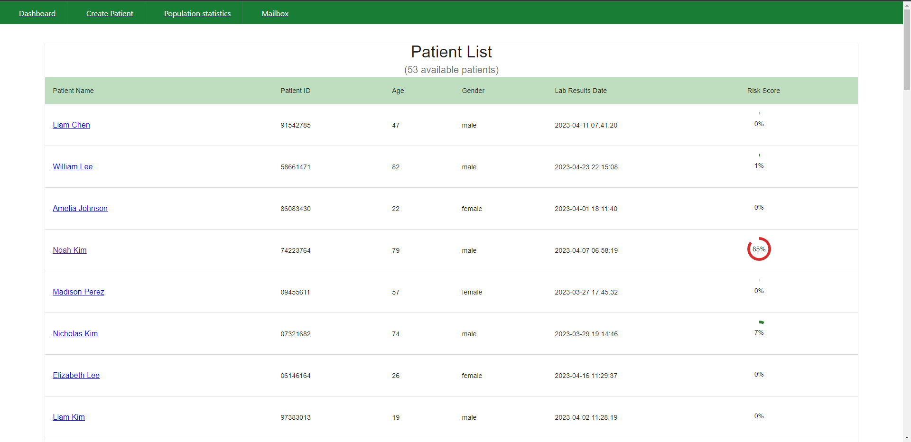
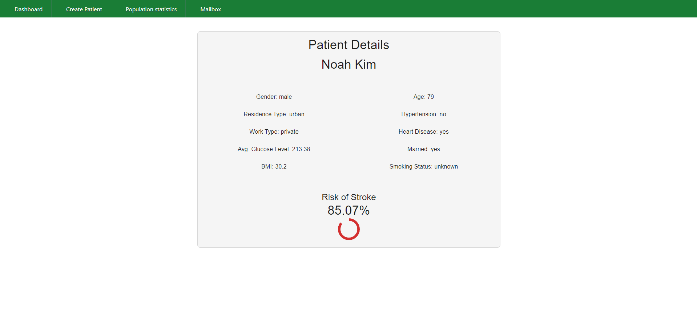
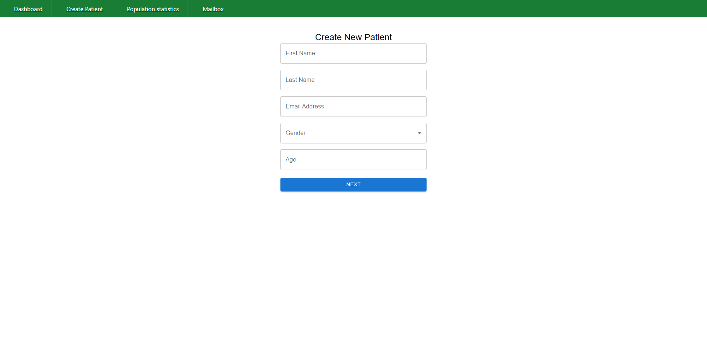
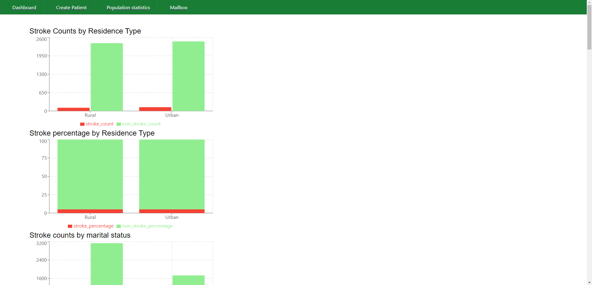
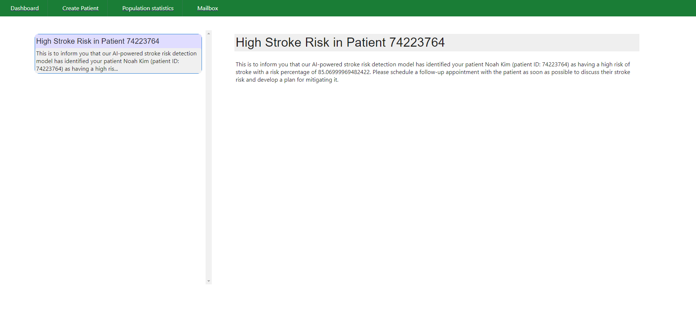

# stroke_prediction_frontend

1. go to ..../stroke_prediction_web_app path
2. make sure all packages are installed by executing "pip install -r requirements.txt"
3. execute "python backend_main_app.py" then go to "http://localhost:8084/getPatientList" on your browser ---> This is your BACKEND PORT (8084)
4. go to /stroke-prediction-frontend path
5. do "npm install" to install all required node modules
6. start the frontend application by executing "npm start"
7. The app should be running on "http://localhost:3000" on your browser ---> This is your FRONEND PORT (3000)

## Pages

1. Dashboard for displaying patient list

2. Patient Details Page

3. Create Patient

4. Population Level Predictions

5. Mailbox

## Available Scripts

In the project directory, you can run:

### `npm start`

Runs the app in the development mode.\
Open [http://localhost:3000](http://localhost:3000) to view it in your browser.

The page will reload when you make changes.\
You may also see any lint errors in the console.

### `npm test`

Launches the test runner in the interactive watch mode.\
See the section about [running tests](https://facebook.github.io/create-react-app/docs/running-tests) for more information.

### `npm run build`

Builds the app for production to the `build` folder.\
It correctly bundles React in production mode and optimizes the build for the best performance.

The build is minified and the filenames include the hashes.\
Your app is ready to be deployed!

See the section about [deployment](https://facebook.github.io/create-react-app/docs/deployment) for more information.

### Deployment

This section has moved here: [https://facebook.github.io/create-react-app/docs/deployment](https://facebook.github.io/create-react-app/docs/deployment)

